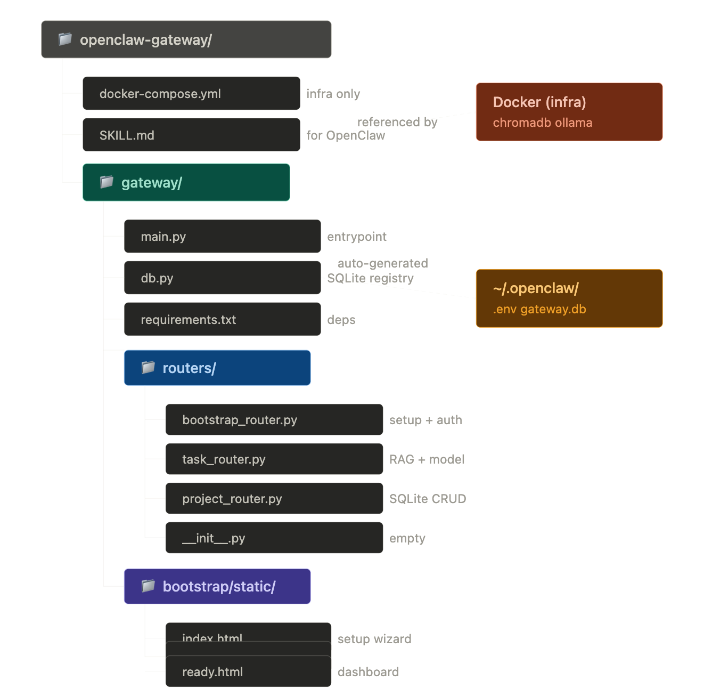

# KL Gateway

KL Gateway is an API Gateway project using Python (FastAPI) to manage and route requests to backend services.

## Table of Contents
- [Introduction](#introduction)
- [Project Structure](#project-structure)
- [Installation](#installation)
- [Running the Project](#running-the-project)
- [Docker](#docker)
- [Contributing](#contributing)
- [License](#license)

## Introduction
This project acts as a middleware gateway, receiving requests from clients and forwarding them to internal services, while handling authentication, authorization, and related logic.

## Project Structure


## Installation
Requirements:
- Python 3.12+
- pip
- Docker (if running with containers)

Install dependencies:
```bash
cd gateway
pip install -r requirements.txt
```

## Running the Project
Run directly with FastAPI/Uvicorn:
```bash
cd gateway
uvicorn main:app --reload
```

## Docker
Build and run with Docker Compose:
```bash
docker-compose up --build
```

## Contributing
- Fork the repo, create a new branch, and submit a pull request.
- Ensure code follows PEP8 and add tests if needed.

## License
MIT
